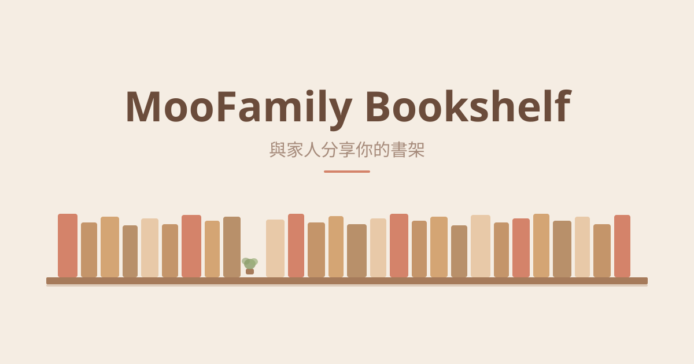

# 墨家書櫃 MooFamily Bookshelf

[English](README.en.md)

讓讀墨家庭帳號成員，輕鬆瀏覽彼此選擇分享的書籍。

## 功能

- **家庭書櫃** — 一眼看到家人分享的藏書，不用借帳號、不用傳書名
- **互相借閱** — 申請家人開放的書，書主一鍵同意，自動完成讀墨借出流程
- **你決定要分享什麼** — 所有書籍預設不公開，只有你手動開放的書才會出現在家庭書櫃
- **資料安全** — 所有資料透過 HTTPS 安全傳輸，以認證 Token 控管存取權限
- **跨家庭保留設定** — 離開或更換家庭，你的分享偏好不會消失
- **手機也能看** — 透過手機版網頁瀏覽家庭書櫃，不限桌機

## 安裝

### Chrome Web Store（推薦）

適用瀏覽器：Chrome、Edge、Opera

[前往 Chrome 線上應用程式商店安裝](https://chromewebstore.google.com/detail/ogclfjfjdiminibemhbckobeapnohjnk?utm_source=github)

手動安裝（Chrome）

1. [下載最新版本](https://github.com/reginna-chao/moo-family-bookshelf/releases) (`moo-family-bookshelf-vX.X.X.zip`) 並解壓縮
2. 開啟 Chrome，在網址列輸入 `chrome://extensions/`
3. 打開右上角「開發人員模式」
4. 點擊「載入未封裝項目」，選取解壓縮的資料夾
5. 完成！前往讀墨網頁，你會看到「家庭書櫃」按鈕

### Firefox（桌面版 / Android™）

適用瀏覽器：Firefox

也支援 Firefox 桌面版與 Firefox for Android™（火狐手機版）。

- AMO 安裝連結：（即將上架，連結待補）<!-- TODO: 上架 AMO 後補上正式網址 -->

手動安裝（Firefox）

1. 取得 Firefox 版本：可從 [Releases](https://github.com/reginna-chao/moo-family-bookshelf/releases) 下載，或自行建置 `pnpm --filter moo-family-bookshelf-extension build:firefox`（輸出在 `extension/dist-firefox/`）
2. 開啟 Firefox，在網址列輸入 `about:debugging#/runtime/this-firefox`
3. 點擊「載入暫時性的附加元件…」（Load Temporary Add-on）
4. 選取 `dist-firefox/manifest.json`
5. 完成！前往讀墨網頁，你會看到「家庭書櫃」按鈕

## 使用方式

1. **建立家庭** — 在讀墨網頁點擊「家庭書櫃」，建立家庭後取得同步碼
2. **邀請家人** — 把同步碼傳給家人，對方輸入後就能加入
3. **選擇分享的書** — 在「個人書櫃管理」逐本切換開放/關閉，儲存後才同步
4. **瀏覽家庭書櫃** — 在「家庭書櫃」看到所有家人分享的書

手機使用者可以透過手機版網頁瀏覽家庭書櫃（建議先在電腦版完成一次同步）。

## 隱私

- 安全存取控制 — 所有資料透過 HTTPS 傳輸，以認證 Token 嚴格控管存取
- 不收集個人資料 — 不需要帳號、不記錄 Email、不追蹤使用者
- 離開家庭即隔離 — 退出後，其他成員立刻無法看到你的書

完整隱私政策請參閱[隱私政策頁面](https://reginna-chao.github.io/moo-family-bookshelf/privacy-policy.html)。

## 常見問題

請參閱[常見問題頁面](https://reginna-chao.github.io/moo-family-bookshelf/#faq)。

---

## 開發者

想要貢獻或自建後端？請參閱 [CONTRIBUTING.md](CONTRIBUTING.md)。

## 支持開發

## 授權

[MIT License](LICENSE)

本專案與 Readmoo 讀墨無官方關聯。
